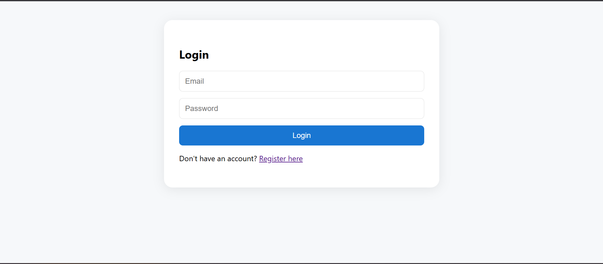
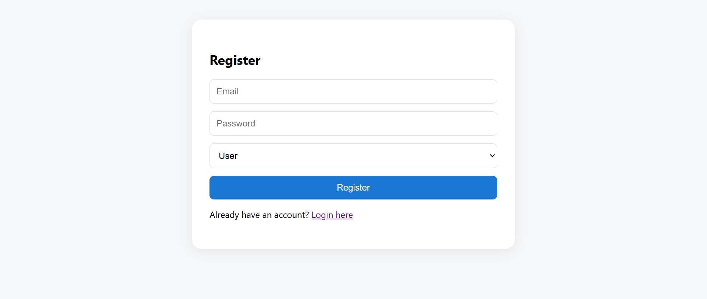
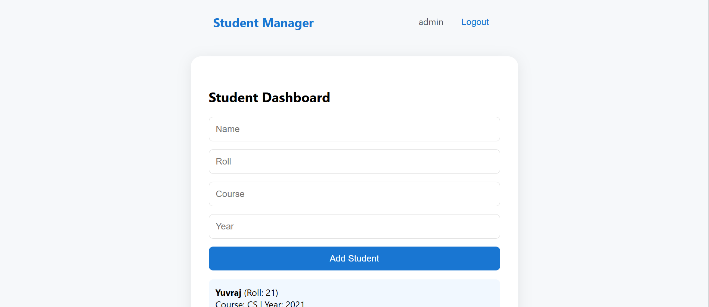
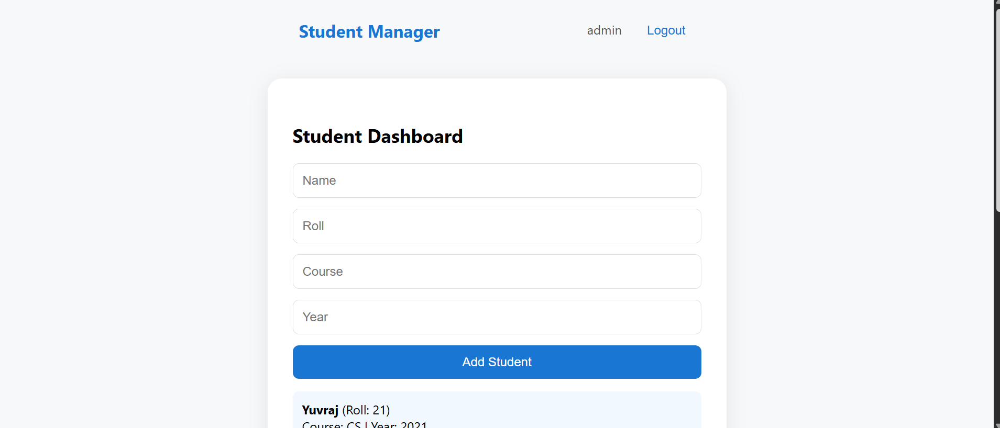

# Student Management System

A full-stack dashboard-based student CRUD system with role-based access control (admin vs user). Built using the MERN stack (MongoDB, Express, React, Node.js).

---

## 🚀 Features

- **Role-based access:** Admins can manage all students; users can manage only their own.
- **Authentication:** JWT-based login and registration.
- **CRUD:** Create, Read, Update, Delete students.
- **Responsive UI:** Works on desktop and mobile.
- **Modern dashboard:** Clean, intuitive interface.

---

## 📂 Folder Structure

student-management-system/
├── server/ # Express + MongoDB backend
│ ├── config/
│ ├── middleware/
│ ├── models/
│ ├── routes/
│ ├── .env
│ └── server.js
├── client/ # React frontend
│ ├── public/
│ ├── src/
│ │ ├── components/
│ │ ├── pages/
│ │ ├── redux/
│ │ ├── App.js
│ │ ├── App.css
│ │ └── index.js
│ └── package.json
└── README.md

---

## 🛠️ Setup Instructions

### 1. **Clone the repository**

git clone https://github.com/your-username/student-management-system.git
cd student-management-system

### 2. **Backend Setup**

cd server
npm install

- Create a `.env` file in the `server/` directory:

MONGO_URI=mongodb://localhost:27017/studentdb
JWT_SECRET=your_jwt_secret
PORT=5000

- Start the backend server:
  node server.js

### 3. **Frontend Setup**

cd ../client
npm install
npm start

- The app will open at [http://localhost:3000](http://localhost:3000).

---

## 👥 Roles

- **Admin:** Can view, add, edit, and delete all students.
- **User:** Can view, add, and edit only their own students.

---

## 🖥️ Screenshots

>  >  >  > 

---

## 📋 API Documentation

All API endpoints require `Authorization: Bearer <token>` except for `/api/auth/*`.

### **Authentication**

| Method | Route                | Body                        | Response          |
| ------ | -------------------- | --------------------------- | ----------------- |
| POST   | `/api/auth/register` | `{ email, password, role }` | `{ token, role }` |
| POST   | `/api/auth/login`    | `{ email, password }`       | `{ token, role }` |

### **Student Management**

| Method | Route               | Role  | Body / Params                  | Description                  |
| ------ | ------------------- | ----- | ------------------------------ | ---------------------------- |
| GET    | `/api/students`     | admin | —                              | Get all students             |
| GET    | `/api/students/my`  | user  | —                              | Get students created by user |
| POST   | `/api/students`     | all   | `{ name, roll, course, year }` | Add a new student            |
| PUT    | `/api/students/:id` | admin | `{ name, roll, course, year }` | Update a student             |
| DELETE | `/api/students/:id` | admin | —                              | Delete a student             |

---

## 🧪 Example API Request

**Register a new user:**
POST /api/auth/register
Content-Type: application/json

{
"email": "admin@example.com",
"password": "admin123",
"role": "admin"
}

**Get all students (admin):**
GET /api/students
Authorization: Bearer <token>

---

## 💡 Tech Stack

- **Frontend:** React, Redux Toolkit, Axios, React Router
- **Backend:** Node.js, Express.js, MongoDB, Mongoose, JWT, bcryptjs
- **Styling:** CSS (responsive, modern dashboard)

---

## 🏗️ Deployment

- You can deploy the backend to [Render](https://render.com/) or [Heroku](https://heroku.com/).
- Deploy the frontend to [Vercel](https://vercel.com/) or [Netlify](https://netlify.com/).
- Update the frontend `proxy` or API URLs for production.

---

## 📞 Contact

For questions or support, open an issue or email [ayush.tesla@gmail.com](mailto:ayush.tesla@gmail.com).

---

**Happy coding! 🚀**
